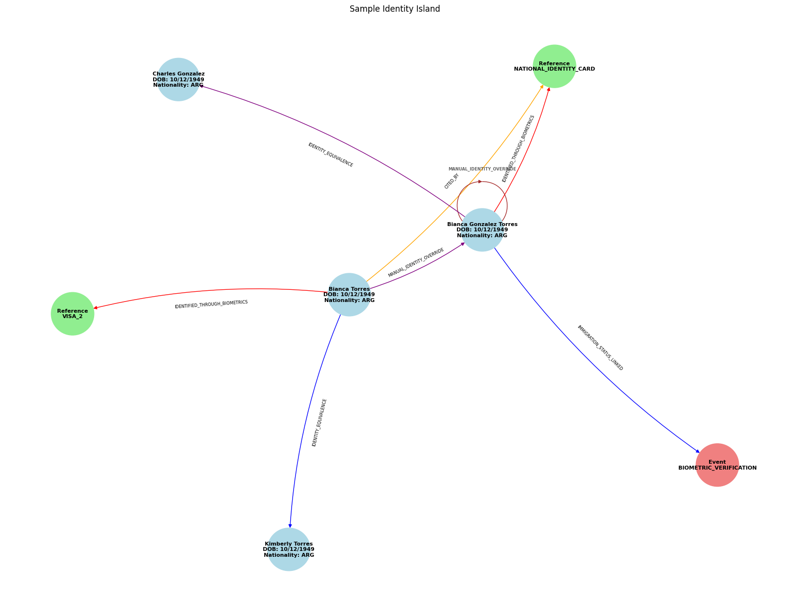
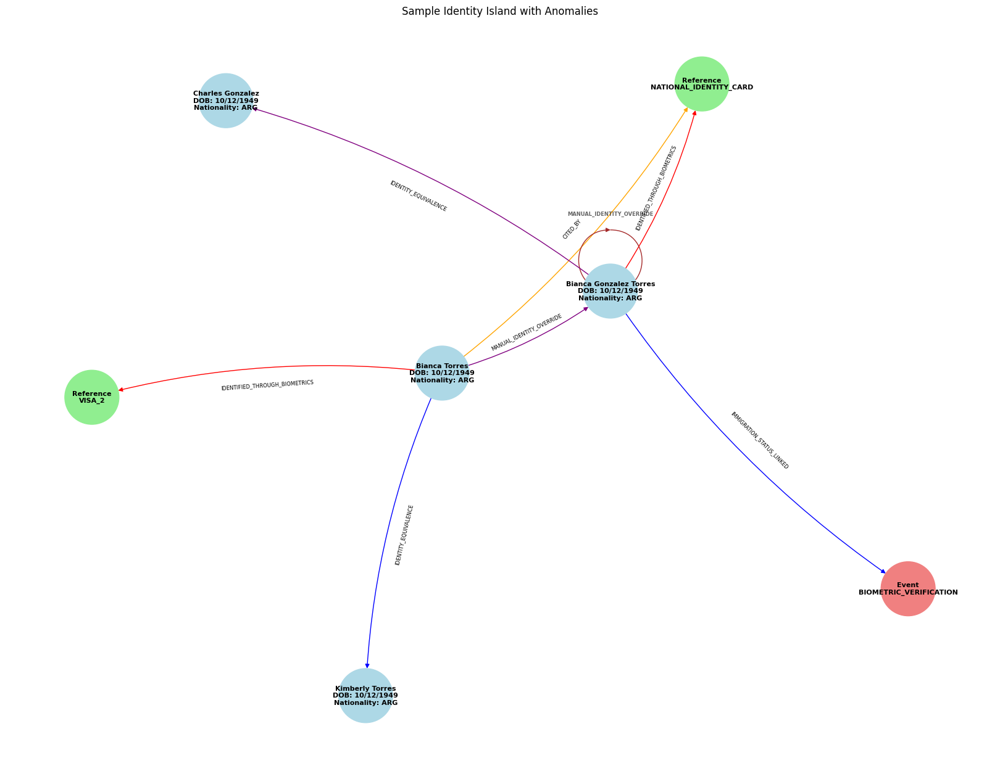

# Synthetic Identity Islands Project

## Project Overview

This project aims to generate synthetic identity data, introduce anomalies, and use various machine learning models to detect these anomalies. The project leverages AWS Neptune for graph database capabilities and EC2 for running machine learning models.

### Key Features
- **Synthetic Data Generation:** Create synthetic identity data for testing and development purposes.
- **Anomaly Introduction:** Introduce anomalies into the synthetic data to simulate real-world data issues.
- **AWS Neptune Integration:** Ingest data into AWS Neptune and use Gremlin queries to explore the graph data.
- **Anomaly Detection:** Utilize machine learning models on EC2 to detect anomalies within the data.

## Project Structure

```plaintext
synthetic-identity-project/
├── notebooks/
│   ├── data_generation.ipynb
│   ├── introduce_anomalies.ipynb
│   ├── data_ingestion.ipynb
│   ├── gremlin_queries.ipynb
│   ├── representation_indentity_island.ipynb
│   └── anomaly_detection.ipynb
├── terraform/
│   ├── main.tf
│   ├── variables.tf
│   ├── outputs.tf
│   ├── aws/
│   │   ├── neptune.tf
│   │   └── ec2.tf
├── gremlin/
│   ├── queries.txt
├── scripts/
│   ├── deploy.sh
│   ├── destroy.sh
│   ├── generate_data.py
│   ├── introduce_anomalies.py
│   ├── ingest_to_neptune.py
│   ├── train_model.py
│   └── detect_anomalies.py
├── data/
│   ├── synthetic_data/
│   ├── anomalies/
│   ├── representation_indentity_island/
│   └── ingested_data/
├── models/
│   └── trained_models/
├── README.md
├── requirements.txt
└── .gitignore
```

## Visualizations

### Identity Island
**Identity islands** refer to clusters of identities that are variations of a central identity but contain slight differences. These islands represent various forms of the same individual’s identity, with variations in their name, middle name, or other attributes. The idea is to simulate real-world scenarios where individuals may have multiple forms of identification or slightly different records in different databases.

**Key Concepts and Logic Behind Identity Islands:**
1. **Base Identity:**
   - The base identity is generated with key attributes such as a unique ID, name, date of birth, age, and nationality.
   - This identity serves as the root from which variations are created.

2. **Partial Names and Variations:**
   - Variations of the base identity's name are generated by manipulating the base name (e.g., adding a middle name, using a second name, etc.).
   - Each variation is also assigned a unique ID and retains the same date of birth and nationality as the base identity.

3. **Relationships within an Island:**
   - Edges (relationships) between the base identity and its variations are created. These relationships can be of various types, such as `IDENTITY_EQUIVALENCE`, `INCLUDED_IN`, `CITED_BY`, `IDENTIFIED_THROUGH_BIOMETRICS`, etc.
   - The graph structure represents the interconnectedness of the different identity variations, making it a cohesive island.
   


### Identity Island With Anomalies
Anomalies are introduced to simulate discrepancies and errors that can occur in real-world data. These anomalies help in testing the robustness of systems designed to detect and resolve identity-related issues.

**Types of Anomalies and Their Logic:**

1. **Duplicate Identity:**
   - A duplicate identity with minor changes (such as a slightly altered name) is created and linked back to the original identity using an `IDENTITY_EQUIVALENCE` edge.
   - This simulates cases where a person might have multiple identities with small differences.

2. **Inconsistent Reference:**
   - A reference document (e.g., passport, national ID) that does not logically match any identity in the island is added.
   - This can occur due to data entry errors or fraudulent documents, and it is linked to a random identity in the island using a `CITED_BY` edge.

3. **Mislinked Identity:**
   - An identity from a different island that has a similar attribute (e.g., name) is linked using an `IDENTITY_EQUIVALENCE` edge.
   - This represents cases where two different individuals are mistakenly linked due to similarities in their attributes.

4. **Incorrect Event:**
   - An event (e.g., biometric verification) that does not logically connect to the identities within the island is introduced.
   - Such events might be incorrectly recorded or linked to the wrong person, simulating data integrity issues.



## Getting Started

### Prerequisites

- **Python 3.10+**: Make sure you have Python installed. You can download it from [python.org](https://www.python.org/downloads/).
- **Terraform**: Install Terraform for managing AWS resources. Follow the installation guide on the [Terraform website](https://www.terraform.io/downloads.html).
- **AWS CLI**: Install the AWS Command Line Interface. Instructions are available on the [AWS CLI website](https://aws.amazon.com/cli/).

### Installation

1. **Clone the repository**:
   ```sh
   git clone https://github.com/yourusername/synthetic-identity-project.git
   cd synthetic-identity-project
   ```

2. **Install Python dependencies**:
   ```sh
   pip install -r requirements.txt
   ```

## Contributing

Contributions are welcome! Please submit a pull request or open an issue to discuss what you would like to change.

## License

This project is licensed under the MIT License - see the [LICENSE](LICENSE) file for details.

## Acknowledgments

- Thanks to [OpenAI](https://openai.com/) for providing the AI assistance.
- Inspired by various synthetic data generation and anomaly detection projects.# synthetic-identity-project
